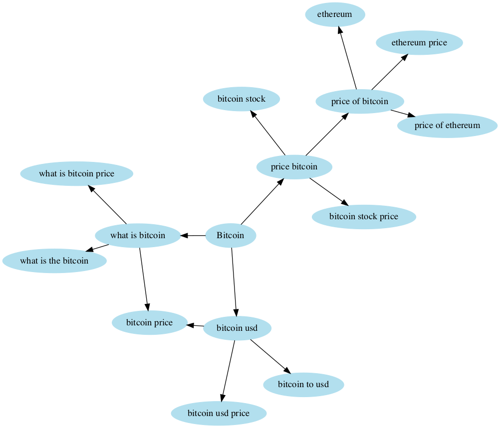
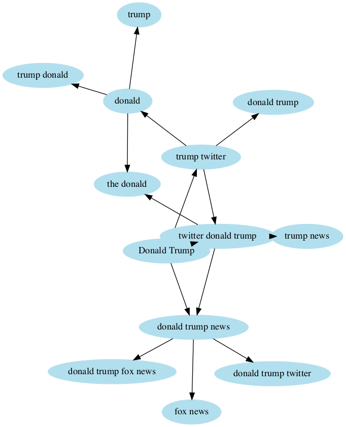

# Google trends data exploration
A quick notebook that uses the `pytrends` package to interface with the google trends API. Uses `graphviz` to generate related search graphs based on a keyword that you provide. Some examples are shown below.

Keyword: Bitcoin


Keyword: Donald Trump


## Setup
Requires Python 3.6 with conda and jupyter notebook installed.

Add the required packages for this project from within a conda environment with
```
pip install -r requirements.txt
```

## Future work
Some additional capabilities that `pytrends` provides include top searched keywords for a region at a particular time that may be interesting to visualize.

There is also hourly google trends data available which may be well-suited for time series analysis of google trends keywords. 

Add an issue if you want to see one of these developed!